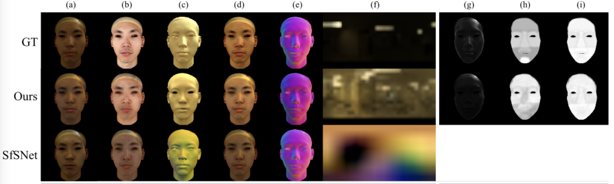

# Learning Physically-based Material and Lighting Decompositions for Face Editing
[Qian Zhang*](https://qianzhanginfo.github.io/),
[Vikas Thamizharasan*](https://vikastmz.github.io/),
[James Tompkin](http://www.jamestompkin.com) \
Brown University \
CVM 2022
### [Paper](https://qianzhanginfo.github.io/assets/pubs/relightfaces.pdf) | [Presentation Slides](https://docs.google.com/presentation/d/1NUiE59M7zGXwebPeuUKw0qA1NN_2RGsf9lxWQ74qgW0/edit?usp=sharing)



_Comparisons of Ours and SfSNet (re-trained on our data) with Ground Truth (GT). Row GT: column (a) is the Input image. Row Ours and SfSNet: (a) Reconstruction. Columns from left to right: (b) Albedo, (c) Shading, (d) Diffuse, (e) Normal, (f) Illumination, (g) Specular, (h) Rho Map, (i) Roughness Map. \
Note: Reconstructing the full range of radiances in the ground truth images is difficult, causing the ground truth images to have a larger HDR range. Due to subsequent tone mapping, the ground truth HDR environment maps look darker overall. The estimated environment maps have lower intensity range, and so appear more evenly exposed after tone mapping._


## Terms of Use
This project is licenced under the [Brown Computer Science Department Copyright Notice](https://github.com/brownvc/relight-facessss/tree/main/LICENSE), which does not allow commercial use. Anyone wanting to use it for other purposes should contact [Prof. James Tompkin](https://jamestompkin.com/). 

If you use this code in your work, please cite our paper:

```
@article{zhangthamizharasan2022phaced,
  title={Learning Physically-based Material and Lighting Decompositions for Face Editing},
  author={Qian Zhang, Vikas Thamizharasan, James Tompkin},
  journal={Computational Visual Media},
  year={2022}
}
```

## Overview and Environment Setup

### Goal
This piece of code builds a realistic HDR face image set from existing skin reflectance and geometry data, and train a neural network to decompose a single input face image into physically-based layers for editing.

After environment setup, there are three parts of the code. Feel free to jump to the section you need:
- [Quick start: run pre-trained models](#quick-start)
- [Generate training data](#generate-training-dataset)
  - [Download data from sources](#download)
  - [Generate specular rho and roughness maps](#generate-specular-maps)
  - [Render training images](#render-training-images)
- [Train the models](#train-the-models)

### Environment Setup
The code has been tested with Python 3.9.10 and Pytorch=1.10.0 in Ubuntu 18.04 LTS.

The provided setup file can be used to install all dependencies and create a conda environment `phaced`:

```
$ conda env create -f environment.yml
$ conda activate phaced
```

## Quick Start
Test the pre-trained models:

- Download [samples of phaced images](https://drive.google.com/file/d/1TdXNKStvSkMpke4RuvVyIMej8hlsjk9i/view?usp=sharing)(~650MB) using the publishable FaceScape models and unzip to `phaced/data/`.
- Download our pre-trained [model weights](https://drive.google.com/file/d/1hLu0ZbyZ9DRaRDogN6WenpkoMz6I1Wpg/view?usp=sharing)(~200MB) and unzip.

- Infer face decompositions.

```
python test_phaced_models.py \
--image_path data/test_publishable_list/ \
--delight_pretrain_dir pretrained_weights/Delight/phaced_delight-800.pth \
--speculari2i_pretrain_dir pretrained_weights/SpecularI2I/phaced_speculari2i-800.pth \
--diffusei2i_pretrain_dir pretrained_weights/DiffuseI2I/phaced_diffusei2i-800.pth \
--cond_envmap ORG \
--norm_type Weber \
--envmap_approx ORG \
--test_batch_size 8 \
--stage Full
```

## Generate Training Dataset
Code in folder `blender_data_gen`.
```
cd blender_data_gen/
```

### Download
- From [MERL/ETH Skin Reflectance Database dataset](https://vcglab.org/facescanning/) download the Torrance-Sparrow statistics. \
Unzip (~151MB).

- From [FaceScape geometry and texture models](https://facescape.nju.edu.cn/) download TU-Model `facescape_trainset_001_100.zip`. Unzip (~20GB). You may also download all the 847 facemodels, while keeping the publishable models for test images (122, 212, 340, 344, 393, 395, 421, 527, 594, 610).

- From [Laval Indoor HDR Dataset](http://indoor.hdrdb.com/) download envmaps. Gaussian blur and downsample the envmaps, still save as .exr images. We used a [subset](https://drive.google.com/file/d/1siFRCGnX0GL2pk3HTQCCuqGinpUua0UD/view?usp=sharing) of the Laval data: 100 envmaps (~7GB before downsampling, 95 for training, 5 for test).

### Generate specular maps

- We provide a segmentation of the ten face regions.
- Generate rho and roughness maps for face_id 10-151 (~20min, ~550MB)
```
python generate_specularity_maps.py ./eth-merl/ts_data/ts_data.mat
```

### Render training images

- Download [Blender-2.80](https://download.blender.org/release/Blender2.80/) (recommended). Unzip.

- Render train images of resolution 128x128 (~15h, ~400MB)
```
python run_data-generation.py ./blender-2.80-linux-glibc217-x86_64 ./facescape_trainset_1_100/ ./filtered_org_envmaps_train/ -out ./train_[date]_[imgres]/
```

- Train/test image sets ready. Move the training image set and environment maps to `phaced/data/` directory.


## Train the Models
* Separate branch training: use stage "Delight", "DiffuseI2I", or "SpecularI2I".
* End-to-end fine tuning: use stage "Full".
* We recommend to normalize the image set first and then use flag '--image_isnormalized' in training.

```
python train_phaced_models.py \
--image_path data/train/ \
--lr 0.0001 \
--cond_envmap ORG \
--norm_type Weber \
--envmap_approx ORG \
--train_batch_size 8 \
--snapshot_iter 200 \
--num_epochs 800 \
--stage Full
```

## Use other face geometric models
You can use face models other than FaceScape. Here are the things you may want to change:
- Use the colors as in `blender_data_gen/instance_segments.png`.
- Manually mark the 10 face regions according on your texture map and create the mask.
- Replace our `instance_segments.png`.


## Troubleshooting
_We will add to this section as issues arise._


## Declarations
Part of this guide is borrowed from [diffdiffdepth](https://github.com/brownvc/diffdiffdepth) and [dsd](https://github.com/brownvc/decoupled-style-descriptors).

Funding: We thank Brown University, Qian Zhang thanks an Andy van Dam PhD Fellowship, and we declare no competing interests.

Acknowledgements: We thank the reviewers for their detailed feedback. Qian Zhang thanks Kai Wang, Aaron Gokaslan, and Xianghao Xu for initial explorations. Finally, we all thank Chloe LeGendre, Henrique Weber, and Kalyan Sunkavalli for fruitful discussions.

\
*Last updated on Oct 4, 2022 by Qian*
